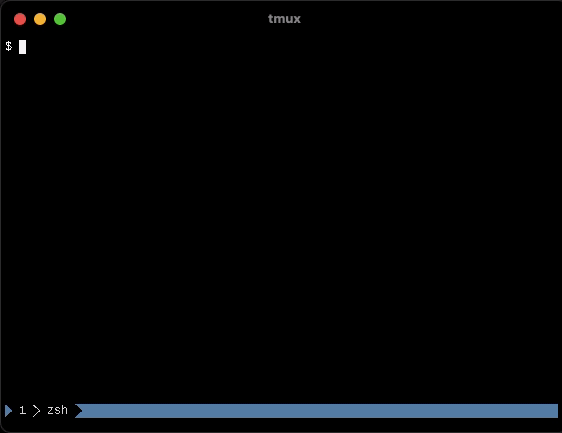
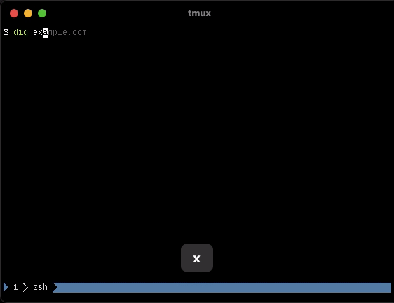

# tmux-fastcopy

- [Introduction](#introduction)
- [Installation](#installation)
- [Usage](#usage)
- [Options](#options)
  - [`@fastcopy-key`](#fastcopy-key)
  - [`@fastcopy-action`](#fastcopy-action)
  - [`@fastcopy-shift-action`](#fastcopy-shift-action)
  - [`@fastcopy-alphabet`](#fastcopy-alphabet)
  - [`@fastcopy-regex-*`](#fastcopy-regex-)
    - [Regex names](#regex-names)
- [How to](#how-to)
  - [Access the regex name](#accessing-the-regex-name)
  - [Copy text to the clipboard](#copy-text-to-the-clipboard)
- [FAQ](#faq)
- [Credits](#credits)
- [Similar projects](#similar-projects)
- [License](#license)

## Introduction

[](https://github.com/abhinav/tmux-fastcopy/actions/workflows/ci.yml)
[](https://codecov.io/gh/abhinav/tmux-fastcopy)

tmux-fastcopy aids in copying of text in a tmux pane with ease.

**How?** When you invoke tmux-fastcopy, it inspects your tmux pane and overlays
important pieces of text you may want to copy with very short labels that you
can use to copy them.

**Demos**: A gif is worth a paragraph or two.

<details>
  <summary>Git hashes</summary>


</details>

<details>
  <summary>File paths</summary>


</details>

<details>
  <summary>IP addresses</summary>


</details>

<details>
  <summary>UUIDs</summary>


</details>

## Installation

Before you install, make sure you are running a supported version of tmux.

```
$ tmux -V
```

Minimum supported version: 2.7.

The following methods of installation are available:

- via [Tmux Plugin Manager](#tmux-plugin-manager)
- [Manual installation](#manual-installation)
- [Binary installation](#binary-installation)

### Tmux Plugin Manager

**Prerequisite**: To use this method, you must have a Go compiler available on
your system.

If you're using [Tmux Plugin Manager](https://github.com/tmux-plugins/tpm), to
install, add tmux-fastcopy to the plugin list in your `.tmux.conf`:

```
set -g @plugin 'abhinav/tmux-fastcopy'
```

Hit `<prefix> + I` to fetch and build it.

### Manual installation

**Prerequisite**: To use this method, you must have a Go compiler available on
your system.

Clone the repository somewhere on your system:

```
git clone https://github.com/abhinav/tmux-fastcopy ~/.tmux/plugins/tmux-fastcopy
```

Source it in your `.tmux.conf`.

```
run-shell ~/.tmux/plugins/tmux-fastcopy/fastcopy.tmux
```

Refresh your tmux server if it's already running.

```
tmux source-file ~/.tmux.conf
```

### Binary installation

Instead of installing tmux-fastcopy as a tmux plugin,
you can install it as an independent binary.

Use one of the following to install the binary.

- If you're using **Homebrew**/Linuxbrew, run:

  ```bash
  brew install abhinav/tap/tmux-fastcopy
  ```

- If you're using **ArchLinux**, install it from AUR using the [tmux-fastcopy](https://aur.archlinux.org/packages/tmux-fastcopy/) package,
  or the [tmux-fastcopy-bin](https://aur.archlinux.org/packages/tmux-fastcopy-bin/) package if you don't want to build it from source.

  ```bash
  git clone https://aur.archlinux.org/tmux-fastcopy.git
  cd tmux-fastcopy
  makepkg -si
  ```

  With an AUR helper like [yay](https://github.com/Jguer/yay), run:

  ```bash
  yay -S tmux-fastcopy
  # or
  yay -S tmux-fastcopy-bin
  ```

- Download a **pre-built binary** from the [releases page](https://github.com/abhinav/tmux-fastcopy/releases)
  and place it on your `$PATH`.

- Build it from source with Go.

  ```bash
  go install github.com/abhinav/tmux-fastcopy@latest
  ```

Once you have the binary installed, add the following to your `.tmux.conf`.

```
bind-key f run-shell -b tmux-fastcopy
```

## Usage

When there is text on the screen you'd like to copy:

1. Press `<prefix> + f` to invoke tmux-fastcopy. (You can change this key by
   setting the [`@fastcopy-key`](#fastcopy-key) option.)
2. Enter the label next to the highlighted text to copy that text.

For example,


By default, the copied text will be placed in your tmux buffer. Paste it by
pressing `<prefix> + ]`.

If you'd like to copy the text to your system clipboard, and you're using
tmux >= 3.2, add the following to your .tmux.conf:

```
set-option -g set-clipboard on
set-option -g @fastcopy-action 'tmux load-buffer -w -'
```

See [How to copy text to the clipboard?](#copy-text-to-the-clipboard) for older versions of
tmux.

## Options

### `@fastcopy-key`

Invoke tmux-fastcopy in tmux with this the `prefix` followed by this key.

**Default**:

```
set-option -g @fastcopy-key f
```

### `@fastcopy-action`

Change how text is copied with this action.

**Default**:

```
set-option -g @fastcopy-action 'tmux load-buffer -'
```

The string specifies the command to run with the selection, as well as the
arguments for the command. The special argument `{}` acts as a placeholder for
the selected text.

```
set-option -g @fastcopy-action 'tmux set-buffer {}'
```

If `{}` is absent from the command, tmux-fastcopy will pass the selected text
to the command over stdin. For example,

```
set-option -g @fastcopy-action pbcopy  # for macOS
```

Note that the command string is executed through the tmux-fastcopy binary, so it must be a path to a binary or shell script that is executable, and is not executed in the context of a full login shell. Additionally, if the command string contains `{}` the selected text is *not* passed via stdin.

### `@fastcopy-shift-action`

An alternative action when you select a label while pressing shift.
Nothing happens if this is unset.

**Default**:

```
set-option -g @fastcopy-shift-action ''
```

Similarly to [`@fastcopy-action`], the string specifies a command and its
arguments, and the special argument `{}` (if any) is a placeholder for the
selected text.

```
set-option -g @fastcopy-shift-action "fastcopy-shift.sh {}"
```

As with `@fastcopy-action`, tmux-fastcopy will set `FASTCOPY_REGEX_NAME` to the
name of the regular expression that matched when running the
`@fastcopy-shift-action`.
See [Accessing the regex name](#accessing-the-regex-name) for more details.

### `@fastcopy-alphabet`

Specify the letters used to generate labels for matched text.

**Default**:

```
set-option -g @fastcopy-alphabet abcdefghijklmnopqrstuvwxyz
```

This must be a string containing at least two letters, and all of them must be
unique.

For example, if you want to only use the letters from the QWERTY home row, use
the following.

```
set-option -g @fastcopy-alphabet asdfghjkl
```

### `@fastcopy-regex-*`

These specify the regular expressions used to match text.

**Default**:

```
set-option -g @fastcopy-regex-ipv4 "\\b\\d{1,3}(?:\\.\\d{1,3}){3}\\b"
set-option -g @fastcopy-regex-gitsha "\\b[0-9a-f]{7,40}\\b"
set-option -g @fastcopy-regex-hexaddr "\\b(?i)0x[0-9a-f]{2,}\\b"
set-option -g @fastcopy-regex-hexcolor "(?i)#(?:[0-9a-f]{3}|[0-9a-f]{6})\\b"
set-option -g @fastcopy-regex-int "(?:-?|\\b)\\d{4,}\\b"
set-option -g @fastcopy-regex-path "(?:[\\w\\-\\.]+|~)?(?:/[\\w\\-\\.]+){2,}\\b"
set-option -g @fastcopy-regex-uuid "\\b(?i)[0-9a-f]{8}(?:-[0-9a-f]{4}){3}-[0-9a-f]{12}\\b"
set-option -g @fastcopy-regex-isodate "\\d{4}-\\d{2}-\\d{2}"
```

Add new regular expressions by introducing new options with the prefix,
`@fastcopy-regex-`. For example, the following will match Phabricator revision
IDs if they're at least three letters long.

```
set-option -g @fastcopy-regex-phab-diff "\\bD\\d{3,}\\b"
```

**Note**: You must double all `\` symbols inside regular expressions to
escape them properly.

<aside>

> Read [this FAQ entry](#word-boundary) for an explanation of the `\\b`s
> inside the regular expressions above.

</aside>

#### Copying substrings

Use regex capturing groups if you wish to copy only a portion of the matched
string. tmux-fastcopy will copy the contents of the first capturing group. For
example,

```
set-option -g @fastcopy-regex-python-import "import ([\\w\\.]+)"
# From "import os.path", copy only "os.path"
```

This also means that to use `(...)` in regular expressions that should copy the
whole string, you should add the `?:` prefix to the start of the capturing
group to ignore it. For example,

```
# Matches commands suggested by 'git status'
set-option -g @fastcopy-regex-git-rebase "git rebase --(?:continue|abort)"
```

#### Regex names

The portion after the `@fastcopy-regex-` can be any name that uniquely
identifies this regular expression.

For example, the name of this regular expression is `phab-diff`

```
set-option -g @fastcopy-regex-phab-diff "\\bD\\d{3,}\\b"
```

You cannot have multiple regular expressions with the same name. New regular
expressions with previously used names will overwrite them. For example, this
overwrites the default `hexcolor` regular expression to copy only the color
code, skipping the preceding `#`:

```
set-option -g @fastcopy-regex-hexcolor "(?i)#([0-9a-f]{3}|[0-9a-f]{6})\\b"
```

You can delete previously defined or default regular expressions by setting
them to a blank string.

```
set-option -g @fastcopy-regex-isodate ""
```

The name of the regular expression that matched the selection is available to
the [`@fastcopy-action`](#fastcopy-action) via the `FASTCOPY_REGEX_NAME` environment variable.
See [Accessing the regex name](#accessing-the-regex-name) for more details.

## How to

### Accessing the regex name

tmux-fastcopy executes the action with the `FASTCOPY_REGEX_NAME` environment
variable set. This holds the [name of the regex](#regex-names) that matched the
selected string.
If multiple different regexes matched the string, `FASTCOPY_REGEX_NAME` holds a
space-separated list of them.

You can use this to customize the action on a per-regex basis.

For example, the following will copy most strings to the tmux buffer as usual.
However, if the string is matched by the "path" regular expression and it
represents an existing directory, this will open that directory in the file
browser.

```bash
#!/usr/bin/env bash

# Place this inside a file like "fastcopy.sh",
# mark it executable (chmod +x fastcopy.sh),
# and set the @fastcopy-action setting to:
#   '/path/to/fastcopy.sh {}'

if [ "$FASTCOPY_REGEX_NAME" == path ] && [ -d "$1" ]; then
    xdg-open "$1"  # on macOS, use "open" instead
    exit 0
fi

tmux set-buffer -w "$1"
```

### Copy text to the clipboard?

To copy text to your system clipboard, you can use tmux's `set-clipboard`
option and change the action to `tmux load-buffer -w -` if you're using
at least tmux 3.2.

```
set-option -g set-clipboard on
set-option -g @fastcopy-action 'tmux load-buffer -w -'
```

With this option set, and the `-w` flag for `load-buffer`, tmux will use the
OSC52 escape sequence to directly set the clipboard for your terminal
emulator--it should work even through an SSH session. Check out
[A guide on how to copy text from anywhere](https://old.reddit.com/r/vim/comments/k1ydpn/a_guide_on_how_to_copy_text_from_anywhere/) to read more about OSC52.

If you're using an older version of tmux or your terminal emulator does not
support OSC52, you can configure `@fastcopy-action` to have tmux-fastcopy
send the text elsewhere. For example,

```
# On macOS:
set-option -g @fastcopy-action pbcopy

# For Linux systems using X11, install [xclip] and use:
#
#  [xclip]: https://github.com/astrand/xclip
set-option -g @fastcopy-action 'xclip -selection clipboard'

# For Linux systems using Wayland, install [wl-clipboard] and use:
#
#  [wl-clipboard]: https://github.com/bugaevc/wl-clipboard
set-option -g @fastcopy-action wl-copy
```

## FAQ

### <a id="word-boundary"></a> What's the `\b` at the ends of some regexes?

The `\b` at either end of the regular expression above specifies that it must
start and/or end at a word boundary. A word boundary is the start or end of a
line, or a non-alphanumeric character.

For example, the regular expression `\bgit\b` will match the string `git`
inside `git rebase --continue` and `git-rebase`, but not inside `github`
because the "h" following the "git" is not a word boundary.

### The entire string did not get copied

If your regular expression uses capturing groups `(...)`, tmux-fastcopy will
only copy the first of these from the matched string.

In the regex below, only the strings "continue" or "abort" will be copied.

```
set-option -g @fastcopy-regex-git-rebase "git rebase --(continue|abort)"
```

To copy the entire string, you can put the whole string in a capturing group,
making it the first capturing group.

```
set-option -g @fastcopy-regex-git-rebase "(git rebase --(continue|abort))"
```

Or you can mark the `(continue|abort)` group as ignored by starting it with
`?:`.

```
set-option -g @fastcopy-regex-git-rebase "git rebase --(?:continue|abort)"
```

### Are regular expressions case sensitive?

Yes, the regular expressions matched by tmux-fastcopy are case sensitive. For
example,

```
set-option -g @fastcopy-regex-github-project "github.com/(\w+/\w+)"
```

This will match `github.com/abhinav/tmux-fastcopy` but not
`GitHub.com/abhinav/tux-fastcopy`.

If you want to turn your regular expression case insensitive, prefix it with
`(?i)`.

```
set-option -g @fastcopy-regex-github-project "(?i)github.com/(\w+/\w+)"
```

### How to overwrite or remove default regexes?

To overwrite or remove default regular expressions, add a new regex to your
`tmux.conf` with the same name as the default one, using a blank string as the
value to delete it.

For example, the following deletes the `isodate` regular expression.

```
set-option -g @fastcopy-regex-isodate ""
```

### Can I have different actions for different regexes?

The `FASTCOPY_REGEX_NAME` environment variable holds the name of the regex that
matched your selection.
You can run different actions on a per-regex basis by inspecting the
`FASTCOPY_REGEX_NAME` environment variable in your
[`@fastcopy-action`](#fastcopy-action).

See [Accessing the regex name](#accessing-the-regex-name) for more details.

## Credits

The plugin is inspired by functionality provided by the [Vimium](https://vimium.github.io/) and
[Vimperator](http://vimperator.org/vimperator) Chrome and Firefox plugins.

## Similar Projects

- [CrispyConductor/tmux-copy-toolkit](https://github.com/CrispyConductor/tmux-copy-toolkit)
- [fcsonline/tmux-thumbs](https://github.com/fcsonline/tmux-thumbs)
- [Morantron/tmux-fingers](https://github.com/Morantron/tmux-fingers)

## License

This software is distributed under the GPL-2.0 License:

```
tmux-fastcopy
Copyright (C) 2023 Abhinav Gupta

This program is free software; you can redistribute it and/or modify
it under the terms of the GNU General Public License as published by
the Free Software Foundation; either version 2 of the License, or
(at your option) any later version.

This program is distributed in the hope that it will be useful,
but WITHOUT ANY WARRANTY; without even the implied warranty of
MERCHANTABILITY or FITNESS FOR A PARTICULAR PURPOSE.  See the
GNU General Public License for more details.

You should have received a copy of the GNU General Public License along
with this program; if not, write to the Free Software Foundation, Inc.,
51 Franklin Street, Fifth Floor, Boston, MA 02110-1301 USA.
```

The LICENSE file holds the full text of the GPL-2.0 license.
