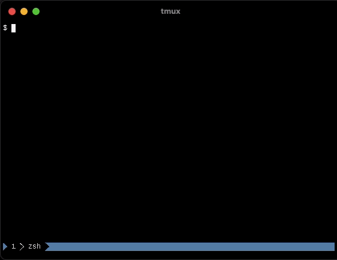
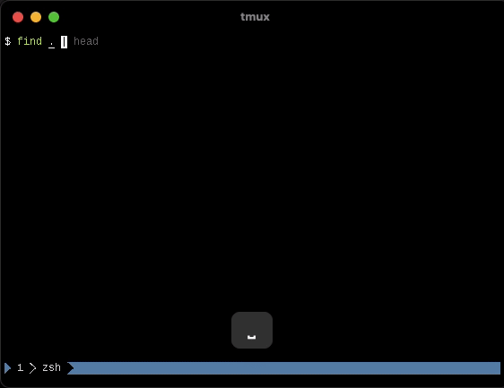
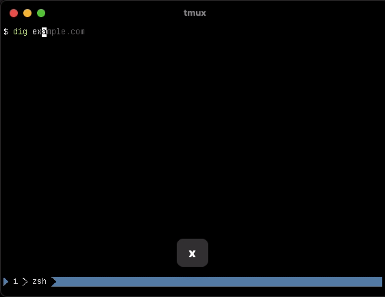
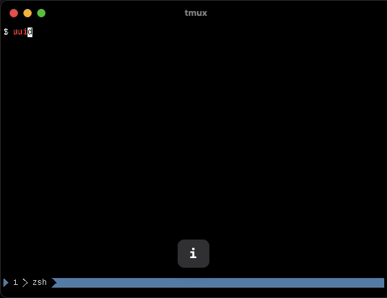

tmux-fastcopy aids in copying of text in a tmux pane with ease.

**How?** When you invoke tmux-fastcopy, it inspects your tmux pane and overlays
important pieces of text you may want to copy with very short labels that you
can use to copy them.

**Demos**: A gif is worth a paragraph or two.

  
Git hashes

  

  
File paths

  

  
IP addresses

  

  
UUIDs

  

